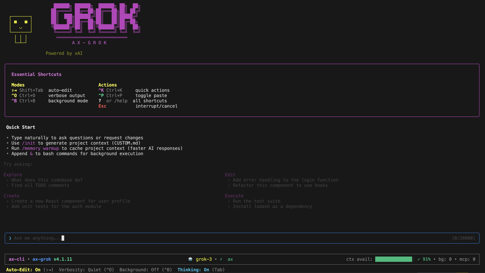

# AX CLI - 엔터프라이즈급 AI 코딩 어시스턴트

> 📖 이 번역은 [README.md @ v5.1.9](./README.md)을 기반으로 합니다

[](https://npm-stat.com/charts.html?package=%40defai.digital%2Fax-cli)
[](#)
[](https://www.apple.com/macos)
[](https://www.microsoft.com/windows)
[](https://ubuntu.com)
[](https://nodejs.org/)
[](https://opensource.org/licenses/MIT)

<p align="center">
  <a href="./README.md">English</a> |
  <a href="./README.zh-CN.md">简体中文</a> |
  <a href="./README.zh-TW.md">繁體中文</a> |
  <a href="./README.ja.md">日本語</a> |
  <a href="./README.ko.md">한국어</a> |
  <a href="./README.de.md">Deutsch</a> |
  <a href="./README.es.md">Español</a> |
  <a href="./README.pt.md">Português</a> |
  <a href="./README.fr.md">Français</a> |
  <a href="./README.vi.md">Tiếng Việt</a> |
  <a href="./README.th.md">ไทย</a>
</p>

## 목차

- [GLM 사용자](#glm-사용자)
- [빠른 시작](#빠른-시작)
- [왜 AX CLI인가?](#왜-ax-cli인가)
- [지원 모델](#지원-모델)
- [설치](#설치)
- [사용법](#사용법)
- [설정](#설정)
- [MCP 통합](#mcp-통합)
- [VSCode 확장](#vscode-확장)
- [AutomatosX 통합](#automatosx-통합)
- [프로젝트 메모리](#프로젝트-메모리)
- [보안](#보안)
- [아키텍처](#아키텍처)
- [패키지](#패키지)

---

## GLM 사용자

> **중요:** ax-glm 클라우드 패키지는 더 이상 사용되지 않습니다. GLM 클라우드 API 액세스를 위해 OpenCode 사용을 권장합니다. OpenCode 시작하기: https://opencode.ai.
>
> **참고:** 로컬 GLM 모델(GLM-4.6, CodeGeeX4)은 Ollama, LMStudio 또는 vLLM을 통한 오프라인 추론을 위해 `ax-cli`를 통해 여전히 완전히 지원됩니다. 아래 [로컬/오프라인 모델](#로컬오프라인-모델-ax-cli) 섹션을 참조하세요.

---

<p align="center">
  
</p>

<p align="center">
  <strong>Grok에 최적화된 엔터프라이즈급 AI 코딩 어시스턴트</strong>
</p>

## 빠른 시작

1분 이내에 시작할 수 있습니다:

```bash
npm install -g @defai.digital/ax-grok
ax-grok setup
ax-grok
```

**최적 용도:** 실시간 웹 검색, 비전, 확장된 추론

CLI 내에서 `/init`를 실행하여 프로젝트 컨텍스트를 초기화하세요.

> **GLM 사용자:** ax-glm 대신 [OpenCode CLI](https://opencode.ai)를 사용하세요.

---

## 왜 AX CLI인가?

| 기능 | 설명 |
|------|------|
| **제공업체 최적화** | Grok (xAI)를 위한 일급 지원, 제공업체별 매개변수 포함 |
| **17개 내장 도구** | 파일 편집, bash 실행, 검색, 할 일 관리 등 |
| **에이전트 동작** | ReAct 추론 루프, 실패 시 자동 수정, TypeScript 검증 |
| **AutomatosX 에이전트** | 백엔드, 프론트엔드, 보안, DevOps 등을 위한 20개 이상의 전문 AI 에이전트 |
| **자율 버그 수정** | 타이머 누수, 리소스 문제, 타입 오류를 스캔하고 롤백 안전성으로 자동 수정 |
| **지능형 리팩토링** | 데드 코드 제거, 타입 안전성 수정, 복잡도 감소를 검증과 함께 수행 |
| **MCP 통합** | 12개 이상의 프로덕션 준비 템플릿이 있는 Model Context Protocol |
| **프로젝트 메모리** | 50% 토큰 절약을 달성하는 지능형 컨텍스트 캐싱 |
| **엔터프라이즈 보안** | AES-256-GCM 암호화, 텔레메트리 없음, CVSS 등급 보호 |
| **65% 테스트 커버리지** | 6,084개 이상의 테스트, 엄격한 TypeScript |

---

### 제공업체 하이라이트 (Grok)

- **Grok (ax-grok)**: 내장 웹 검색, 비전, reasoning_effort; **Grok 4.1 빠른 변형은 2M 컨텍스트, 병렬 서버 도구, x_search 및 서버 측 코드 실행을 제공**.
- ax-grok은 완전한 도구 체인(파일 편집, MCP, bash)과 프로젝트 메모리 기능을 제공합니다.

> **GLM 사용자:** [OpenCode CLI](https://opencode.ai)를 사용하세요.

---

## 지원 모델

### Grok (xAI)

| 모델 | 컨텍스트 | 기능 | 별칭 |
|------|----------|------|------|
| `grok-4.1` | 131K | 균형 잡힌 기본값, 내장 추론, 비전, 검색 | `grok-latest` |
| `grok-4.1-fast-reasoning` | 2M | 에이전트/도구 집약적 세션에 최적, 추론 포함 | `grok-fast` |
| `grok-4.1-fast-non-reasoning` | 2M | 가장 빠른 에이전트 실행, 확장 추론 없음 | `grok-fast-nr` |
| `grok-4-0709` | 131K | 원래 Grok 4 릴리스 (호환) | `grok-4` |
| `grok-2-image-1212` | 32K | **이미지 생성**: 텍스트에서 이미지 생성 | `grok-image` |

> **모델 별칭**: 전체 모델 이름 대신 `ax-grok -m grok-latest`와 같은 편리한 별칭을 사용하세요.

---

## 설치

### 요구 사항

- Node.js 24.0.0 이상
- macOS 14 이상, Windows 11 이상 또는 Ubuntu 24.04 이상

### 설치 명령

```bash
npm install -g @defai.digital/ax-grok   # Grok (xAI)
```

> **GLM 사용자:** [OpenCode CLI](https://opencode.ai)를 사용하세요.

### 설정

```bash
ax-grok setup
```

설정 마법사가 다음을 안내합니다:
1. API 키의 안전한 암호화 및 저장 (AES-256-GCM 암호화 사용)
2. 기본 AI 모델 및 기타 환경 설정 구성
3. 설정이 올바른지 확인하기 위한 검증

---

## 사용법

### 대화형 모드

```bash
ax-grok              # 대화형 CLI 세션 시작
ax-grok --continue   # 이전 대화 재개
ax-grok -c           # 축약형
```

### 헤드리스 모드

```bash
ax-grok -p "이 코드베이스를 분석해 주세요"
ax-grok -p "TypeScript 오류 수정" -d /path/to/project
```

### 에이전트 동작 플래그

```bash
# ReAct 추론 모드 활성화 (사고 → 행동 → 관찰 사이클)
ax-grok --react

# 계획 단계 후 TypeScript 검증 활성화
ax-grok --verify

# 실패 시 자동 수정 비활성화
ax-grok --no-correction
```

기본적으로 자동 수정이 활성화되어 있습니다 (에이전트가 실패 시 자동으로 반성하고 재시도). ReAct와 검증은 기본적으로 비활성화되어 있지만, 더 구조화된 추론과 품질 검사를 위해 활성화할 수 있습니다.

### 주요 명령어

| 명령어 | 설명 |
|--------|------|
| `/init` | 프로젝트 컨텍스트 초기화 |
| `/help` | 모든 명령어 표시 |
| `/model` | AI 모델 전환 |
| `/lang` | 표시 언어 변경 (11개 언어) |
| `/doctor` | 진단 실행 |
| `/exit` | CLI 종료 |

### 키보드 단축키

| 단축키 | 동작 | 설명 |
|--------|------|------|
| `Ctrl+O` | 상세도 전환 | 상세 로그 및 내부 프로세스 표시/숨기기 |
| `Ctrl+K` | 빠른 작업 | 일반 명령에 대한 빠른 작업 메뉴 열기 |
| `Ctrl+B` | 백그라운드 모드 | 현재 작업을 백그라운드에서 실행 |
| `Shift+Tab` | 자동 편집 | AI 기반 코드 제안 트리거 |
| `Esc` ×2 | 취소 | 현재 입력 지우기 또는 진행 중인 작업 취소 |

---

## 설정

### 설정 파일

| 파일 | 용도 |
|------|------|
| `~/.ax-grok/config.json` | 사용자 설정 (암호화된 API 키) |
| `.ax-grok/settings.json` | 프로젝트 오버라이드 |
| `.ax-grok/CUSTOM.md` | 사용자 정의 AI 지침 |
| `ax.index.json` | 공유 프로젝트 인덱스 (루트에 위치) |

### 환경 변수

```bash
# CI/CD용
export XAI_API_KEY=your_key    # Grok
```

---

## MCP 통합

[Model Context Protocol (MCP)](https://modelcontextprotocol.io)로 기능 확장 — AI 어시스턴트를 외부 도구, API 및 데이터 소스에 연결하기 위한 개방형 표준:

```bash
ax-grok mcp add figma --template
ax-grok mcp add github --template
ax-grok mcp list
```

**사용 가능한 템플릿:** Figma, GitHub, Vercel, Puppeteer, Storybook, Sentry, Jira, Confluence, Slack, Google Drive 등.

---

## VSCode 확장

```bash
code --install-extension defai-digital.ax-cli-vscode
```

- 사이드바 채팅 패널
- 파일 변경 diff 미리보기
- 컨텍스트 인식 명령
- 체크포인트 및 되감기 시스템

---

## AutomatosX 통합

AX CLI는 [AutomatosX](https://github.com/defai-digital/automatosx)와 통합됩니다 - 자율 버그 수정, 지능형 리팩토링 및 20개 이상의 전문 에이전트가 있는 멀티 에이전트 AI 시스템.

대화형 모드(`ax-grok`)에서 자연스럽게 질문하세요:

```
> 이 코드베이스의 버그를 스캔하고 수정해 주세요

> 인증 모듈을 리팩토링하고, 데드 코드 제거에 집중해 주세요

> 보안 에이전트를 사용하여 API 엔드포인트를 감사해 주세요
```

**얻을 수 있는 것:**
- **버그 수정**: 타이머 누수, 누락된 정리, 리소스 문제 감지 - 롤백 안전성으로 자동 수정
- **리팩토링**: 데드 코드 제거, 타입 안전성 수정, 복잡도 감소 - 타입 검사로 검증
- **20개 이상의 에이전트**: 백엔드, 프론트엔드, 보안, 아키텍처, DevOps, 데이터 등

---

## 프로젝트 메모리

관련 프로젝트 정보를 저장하고 검색하는 지능형 캐싱으로 토큰 비용을 줄이고 컨텍스트 회상을 개선하며, 중복 처리를 방지합니다.

```bash
ax-grok memory warmup    # 컨텍스트 캐시 생성
ax-grok memory status    # 토큰 분포 보기
```

---

## 보안

- **API 키 암호화:** PBKDF2 (60만 반복)를 사용한 AES-256-GCM
- **텔레메트리 없음:** 제로 데이터 수집
- **CVSS 보호:** 명령 주입 (CVSS 9.8), 경로 탐색 (CVSS 8.6), SSRF (CVSS 7.5) 등 일반적인 취약점에 대한 강력한 보호

---

## 아키텍처

AX CLI는 공유 코어를 기반으로 모듈식 아키텍처를 사용합니다:

```
┌─────────────────────────────────────────────────────────────┐
│                      사용자 설치                             │
├─────────────────────────────────────────────────────────────┤
│                  @defai.digital/ax-grok                     │
│                     (ax-grok CLI)                           │
│                                                             │
│  • Grok 3 확장 추론                                          │
│  • xAI API 기본값                                            │
│  • 실시간 웹 검색                                            │
│  • ~/.ax-grok/ 설정                                         │
├─────────────────────────────────────────────────────────────┤
│                   @defai.digital/ax-core                    │
│                                                             │
│  공유 기능: 17개 도구, MCP 클라이언트, 메모리, 체크포인트,     │
│  React/Ink UI, 파일 작업, git 지원                           │
└─────────────────────────────────────────────────────────────┘
```

> **GLM 사용자:** [OpenCode CLI](https://opencode.ai)를 사용하세요.

---

## 패키지

| 패키지 | 설치? | 설명 |
|--------|:-----:|------|
| [@defai.digital/ax-grok](https://www.npmjs.com/package/@defai.digital/ax-grok) | **예** | Grok 최적화 CLI, 웹 검색, 비전, 확장 사고 포함 |
| [@defai.digital/ax-cli](https://www.npmjs.com/package/@defai.digital/ax-cli) | 선택 | 로컬 우선 CLI, Ollama/LMStudio/vLLM + DeepSeek Cloud 지원 |
| [@defai.digital/ax-core](https://www.npmjs.com/package/@defai.digital/ax-core) | 아니오 | 공유 코어 라이브러리 (의존성으로 자동 설치) |
| [@defai.digital/ax-schemas](https://www.npmjs.com/package/@defai.digital/ax-schemas) | 아니오 | 공유 Zod 스키마 (의존성으로 자동 설치) |

> **GLM 사용자:** ax-glm은 더 이상 사용되지 않습니다. [OpenCode CLI](https://opencode.ai)를 사용하세요.

---

## 라이선스

MIT 라이선스 - [LICENSE](LICENSE) 참조

---

<p align="center">
  <a href="https://github.com/defai-digital">DEFAI Digital</a>이 정성을 다해 제작
</p>
