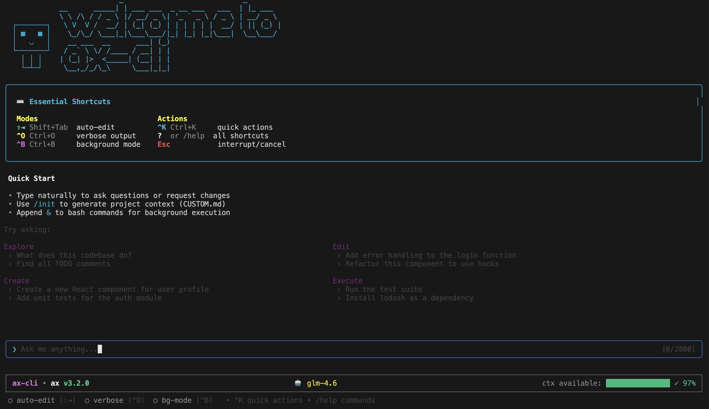

# AX CLI - Enterprise-Class CLI for Vibe Coding

[](https://npm-stat.com/charts.html?package=%40defai.digital%2Fax-cli)
[](https://github.com/defai-digital/ax-cli/actions/workflows/test.yml)
[](https://github.com/defai-digital/ax-cli)
[](https://nodejs.org/)
[](https://opensource.org/licenses/MIT)

<p align="center">
  
</p>

<p align="center">
  <strong>GLM-Optimized CLI • Enterprise Architecture • 98%+ Test Coverage</strong>
</p>

---

## Quick Start

```bash
# Install globally
npm install -g @defai.digital/ax-cli

# Configure (secure API key setup)
ax-cli setup

# For VSCode users - install the extension (recommended)
code --install-extension defai-digital.ax-cli-vscode

# Initialize your project
ax-cli init

# Start coding!
ax-cli
```

**That's it!** AX CLI is now ready to help you build, debug, and ship code faster. VSCode users get enhanced features with the native extension.

---

## Table of Contents

- [Features](#features)
- [Installation](#installation)
- [Provider-Specific CLIs](#provider-specific-clis)
- [Configuration](#configuration)
- [Usage](#usage)
- [VSCode Integration](#vscode-integration)
- [MCP Integration](#mcp-integration)
- [Project Memory](#project-memory)
- [Multi-Phase Planner](#multi-phase-task-planner)
- [Security](#security)
- [Architecture](#architecture)
- [Changelog](#changelog)
- [Documentation](#documentation)

---

## Features

### Core Capabilities

| Feature | Description |
|---------|-------------|
| **GLM-Optimized** | Primary support for Z.AI's GLM-4.6 (200K context) and GLM-4.5v (vision) |
| **Multi-Phase Planner** | Intelligent task decomposition for complex requests |
| **Session Continuity** | Directory-specific conversation history with `--continue` |
| **MCP Integration** | Model Context Protocol with 12+ production-ready templates |
| **Project Memory** | Intelligent context caching with 50% token savings |
| **Smart Verbosity** | Three-level output control (Quiet → Concise → Verbose) |
| **Auto-Update** | Automatic update check on startup with user confirmation |

### AI Provider Support

- **Z.AI GLM-4.6** (default) - 200K context, optimized for complex code generation
- **Z.AI GLM-4.5v** (vision) - 64K multimodal context, auto-switches for image analysis
- **OpenAI** - GPT-4, GPT-3.5
- **Anthropic** - Claude models
- **Ollama** - Local models
- **Custom endpoints** - Any OpenAI-compatible API

### Security (Enterprise-Grade, FREE)

| Protection | Severity | Description |
|------------|----------|-------------|
| API Key Encryption | - | AES-256-GCM encryption at rest |
| Command Injection | CVSS 9.8 | Safe command execution with whitelisting |
| Path Traversal | CVSS 8.6 | Prevent unauthorized file system access |
| SSRF Prevention | CVSS 7.5 | Validate MCP transport URLs |
| Input Sanitization | CVSS 7.0 | Comprehensive input validation |
| Rate Limiting | - | Token bucket algorithm (100 req/min) |

### Code Analysis Tools

- **Dependency Analyzer** - Circular dependencies, coupling metrics
- **Code Smell Detector** - 10+ anti-patterns detection
- **Hotspot Analyzer** - Git history-based complexity analysis
- **Security Scanner** - SQL injection, XSS, hardcoded secrets
- **Multi-Language Support** - TypeScript, JavaScript, Python, Rust, Go, C, C++, Swift, HTML, CSS

---

## Installation

### Supported Platforms

| Platform | Versions | Architecture |
|----------|----------|--------------|
| **macOS** | 26+ | x64, ARM64 (Apple Silicon) |
| **Windows** | 11+ | x64, ARM64 |
| **Ubuntu** | 24.04+ | x64, ARM64 |

### Prerequisites

- Node.js 24.0.0 or higher
- npm package manager

### Install

```bash
npm install -g @defai.digital/ax-cli
```

---

## Provider-Specific CLIs

In addition to the main `ax-cli` package, we offer lightweight provider-specific CLIs for developers who prefer a dedicated experience with their AI provider of choice.

### AX-GLM - GLM-Optimized CLI

**[@defai.digital/ax-glm](https://www.npmjs.com/package/@defai.digital/ax-glm)** - A streamlined CLI optimized for Z.AI's GLM models.

```bash
# Install
npm install -g @defai.digital/ax-glm

# Run
ax-glm
```

**Features:**
- **GLM-4.6** (200K context) - Advanced reasoning and code generation
- **GLM-4.5v** (Vision) - Multimodal support for image analysis
- **Thinking Mode** - Extended reasoning for complex problems
- Pre-configured for optimal GLM performance
- Lightweight package with minimal dependencies

**Supported Models:**
| Model | Context | Description |
|-------|---------|-------------|
| `glm-4.6` | 200K | Latest GLM with superior code generation |
| `glm-4.5v` | 64K | Vision-enabled for image analysis |
| `glm-4.5` | 128K | Balanced performance and context |

### AX-Grok - Grok-Optimized CLI

**[@defai.digital/ax-grok](https://www.npmjs.com/package/@defai.digital/ax-grok)** - A streamlined CLI optimized for xAI's Grok models.

```bash
# Install
npm install -g @defai.digital/ax-grok

# Run
ax-grok
```

**Features:**
- **Grok 3** - Latest Grok model with advanced reasoning
- **Grok 3 Mini** - Fast, cost-effective option
- **Vision Support** - Image understanding capabilities
- **Web Search** - Real-time information retrieval
- **Thinking Mode** - Extended reasoning with transparent thought process
- Pre-configured for optimal Grok performance

**Supported Models:**
| Model | Description |
|-------|-------------|
| `grok-3` | Full Grok 3 with maximum capabilities |
| `grok-3-fast` | Optimized for speed |
| `grok-3-mini` | Lightweight, cost-effective |
| `grok-3-mini-fast` | Fastest response times |

### Choosing Between CLIs

| Package | Best For |
|---------|----------|
| **@defai.digital/ax-cli** | Multi-provider support, enterprise features, maximum flexibility |
| **@defai.digital/ax-glm** | Dedicated GLM users, minimal footprint, China-optimized |
| **@defai.digital/ax-grok** | Dedicated Grok users, real-time search, xAI ecosystem |

All three packages share the same core architecture, tools, and capabilities - they differ only in default provider configuration and package size.

---

## Configuration

### Quick Setup (Recommended)

```bash
ax-cli setup
```

This interactive wizard will:
1. Guide you through provider selection
2. Securely encrypt and store your API key (AES-256-GCM)
3. Configure default model and settings
4. Validate your configuration

Then start `ax-cli` and run `/init` to initialize your project and generate `.ax-cli/CUSTOM.md`.

### Environment Variable Override

For CI/CD pipelines:

```bash
export YOUR_API_KEY=your_api_key_here
ax-cli
```

### Configuration Files

| File | Purpose |
|------|---------|
| `~/.ax-cli/config.json` | User settings (API keys encrypted) |
| `.ax-cli/settings.json` | Project-specific overrides |
| `.ax-cli/CUSTOM.md` | AI behavior customization |
| `.ax-cli/memory.json` | Auto-generated context cache |

### Auto-Update Settings

AX CLI automatically checks for updates on startup and prompts you to install. Configure in `~/.ax-cli/config.json`:

```json
{
  "autoUpdate": {
    "enabled": true,
    "checkIntervalHours": 24,
    "autoInstall": false
  }
}
```

| Setting | Default | Description |
|---------|---------|-------------|
| `enabled` | `true` | Enable/disable automatic update checks |
| `checkIntervalHours` | `24` | Hours between update checks (0 = always check) |
| `autoInstall` | `false` | Auto-install without prompting (not recommended) |

---

## Usage

### Interactive Mode

```bash
# Start interactive chat
ax-cli

# Continue previous conversation
ax-cli --continue
ax-cli -c
```

### Slash Commands

| Command | Description |
|---------|-------------|
| `/help` | Show help |
| `/continue` | Continue incomplete response |
| `/init` | Initialize project |
| `/clear` | Clear chat history |
| `/models` | Switch AI model |
| `/usage` | Show API usage statistics |
| `/doctor` | Run health check diagnostics |
| `/tasks` | List background tasks |
| `/exit` | Exit application |

### Keyboard Shortcuts

| Shortcut | Action |
|----------|--------|
| **Ctrl+O** | Cycle verbosity (Quiet → Concise → Verbose) |
| **Ctrl+B** | Move command to background |
| **Ctrl+K** | Quick actions menu |
| **Shift+Tab** | Toggle auto-edit mode |
| **Ctrl+C** | Clear input (press twice to exit) |
| **Esc×2** | Clear input (press Escape twice quickly) |
| **↑/↓** | Navigate command history |

### Headless Mode

```bash
# One-shot commands
ax-cli -p "analyze this codebase"
ax-cli -p "fix TypeScript errors" -d /path/to/project
ax-cli -p "write tests" --max-tool-rounds 50

# With specific model
ax-cli -p "refactor" --model glm-4.6
```

### Background Tasks

```bash
# Append '&' to run in background
> npm run dev &

# Or press Ctrl+B during execution

# Manage tasks
/tasks              # List all
/task bg_abc123     # View output
/kill bg_abc123     # Kill task
```

### Health Check

```bash
ax-cli doctor           # Run diagnostics
ax-cli doctor --verbose # Detailed output
ax-cli doctor --json    # JSON format
```

---

## MCP Integration

Extend AX CLI with Model Context Protocol servers:

```bash
# Add from template (one command!)
ax-cli mcp add figma --template

# Add custom server
ax-cli mcp add linear --transport sse --url https://mcp.linear.app/sse

# List servers
ax-cli mcp list

# Preview tools
ax-cli mcp tools <server>

# Browse templates
ax-cli mcp browse
```

### Available Templates

Figma, GitHub, Vercel, Puppeteer, Storybook, Sentry, and 6+ more.

### Per-Server Timeout

For long-running tools (e.g., AutomatosX):

```json
{
  "mcpServers": {
    "automatosx": {
      "transport": { "type": "stdio", "command": "ax", "args": ["mcp"] },
      "timeout": 2700000
    }
  }
}
```

---

## VSCode Integration

AX CLI offers two powerful VSCode integration options:

### Option 1: Native VSCode Extension (Recommended)

The official AX CLI extension provides the most seamless experience:

```bash
# Install extension from VSCode Marketplace
code --install-extension defai-digital.ax-cli-vscode

# Or install via VSCode: Extensions → Search "AX CLI"
```

**Key Features:**
- **Terminal Integration with Diff Preview** - File changes appear as diffs with accept/reject
- **Sidebar Chat Panel** - Native chat interface with multiple sessions
- **Secure API Key Storage** - OS-level credential storage (Keychain/Credential Manager)
- **Context-Aware Commands** - Right-click actions for current file/selection
- **Checkpoint & Rewind System** - Automatic checkpoints before changes
- **Multi-Provider AI Support** - Switch between Grok, GLM, Claude, GPT-4o from status bar

**Quick Start:**
1. Install extension: `code --install-extension defai-digital.ax-cli-vscode`
2. Set API key: `Cmd+Shift+K` (Mac) or `Ctrl+Shift+K` (Windows/Linux)
3. Open chat: `Cmd+Shift+A` or click AX icon in sidebar
4. Start coding with AI assistance!

**Keyboard Shortcuts:**
| Shortcut (Mac) | Shortcut (Win/Linux) | Action |
|----------------|---------------------|---------|
| `Cmd+Shift+A` | `Ctrl+Shift+A` | Open Chat |
| `Cmd+Shift+E` | `Ctrl+Shift+E` | Explain Selection |
| `Cmd+Shift+R` | `Ctrl+Shift+R` | Refactor Selection |
| `Cmd+Shift+T` | `Ctrl+Shift+T` | Generate Tests |
| `Cmd+Shift+B` | `Ctrl+Shift+B` | Find Bugs |

### Option 2: Terminal Integration (Lightweight)

Use AX CLI in VSCode's integrated terminal with pre-configured tasks:

```bash
# Copy VSCode templates to your project
cd your-project
mkdir -p .vscode
cp node_modules/@defai.digital/ax-cli/templates/vscode/*.json .vscode/

# Run tasks via Command Palette
Cmd+Shift+P → "Tasks: Run Task" → Select AX task
```

**Available Tasks:**
- AX: Interactive Chat
- AX: Analyze Current File
- AX: Explain Selection  
- AX: Generate Tests for File
- AX: Review Git Changes
- AX: Find Bugs in File

For detailed setup instructions, see **[VSCode Integration Guide](docs/vscode-integration-guide.md)**.

---

## Figma Integration

Connect AX CLI with Figma for design-to-code workflows:

### Interactive Mode (Recommended)

```bash
# Start interactive mode
ax-cli

# Then use natural language:
> Map my Figma file ABC123xyz
> Extract design tokens from my Figma file and format as Tailwind
> Audit my design for accessibility issues
> Search for all button components in my Figma file
```

### CLI Commands

```bash
# Authenticate with Figma
ax-cli design auth login

# Map your Figma file structure
ax-cli design map YOUR_FILE_KEY

# Extract design tokens
ax-cli design tokens pull YOUR_FILE_KEY --format tailwind

# Audit design consistency
ax-cli design audit YOUR_FILE_KEY --rules all
```

For the complete guide, see **[Figma Integration Guide](docs/figma-guide.md)**.

---

## Project Memory

Intelligent context caching for reduced token costs:

```bash
# Initialize (scans codebase)
ax-cli memory warmup

# Output:
# ✓ Project memory generated (3,305 tokens)
# 📊 Token Distribution:
#    Structure:  1,252 tokens (38%)
#    README:     1,111 tokens (34%)
#    Config:       835 tokens (25%)
#    Patterns:      99 tokens (3%)
```

### Commands

| Command | Description |
|---------|-------------|
| `memory warmup` | Create project memory |
| `memory refresh` | Update after changes |
| `memory status` | Show status & token distribution |
| `memory clear` | Remove project memory |
| `memory cache-stats` | Show cache efficiency |

### Options

```bash
ax-cli memory warmup -d 5           # Custom scan depth (1-10)
ax-cli memory warmup -m 12000       # Custom max tokens
ax-cli memory warmup --dry-run      # Preview without saving
```

---

## Multi-Phase Task Planner

Automatic decomposition for complex requests:

```bash
> "Refactor auth, add tests, update docs"

📋 Plan Generated: 4 phases
├── Phase 1: Analysis (low risk)
├── Phase 2: Implementation (medium risk)
├── Phase 3: Testing (low risk)
└── Phase 4: Documentation (low risk)
```

### Plan Commands

| Command | Description |
|---------|-------------|
| `/plans` | List all execution plans |
| `/plan` | Show current plan details |
| `/phases` | Show phase progress |
| `/pause` | Pause current plan |
| `/resume` | Resume paused plan |
| `/skip` | Skip current phase |
| `/abandon` | Abandon current plan |

### Complexity Triggers

- Refactoring, migration, restructuring
- Multi-file changes
- Testing and documentation requests
- Multi-step instructions

---

## Security

### API Key Protection

- **AES-256-GCM** encryption at rest
- **PBKDF2** key derivation (600,000 iterations)
- **Secure permissions** (0600 owner-only)
- **Auto-migration** from plain-text

### Best Practices

1. **CI/CD**: Use environment variables
2. **Permissions**: Verify `ls -la ~/.ax-cli/config.json` shows `-rw-------`
3. **Git**: Add `.ax-cli/` to `.gitignore`
4. **Rotation**: Update regularly via `ax-cli setup`

### Privacy

- API keys: **Never logged**
- Telemetry: **None collected**
- Errors: Sanitized to remove sensitive data

### Report Issues

Email: **security@defai.digital** (private disclosure)

---

## Architecture

- **SSOT Type System** via `@ax-cli/schemas`
- **TypeScript strict mode** with Zod validation
- **98%+ test coverage** (2265+ tests)
- **Modular design** with clean separation
- **Enterprise security** with AES-256-GCM encryption

---

## Changelog

### v4.1.5 - Suppress dotenv Output

- **Fix**: Suppress dotenv v17+ output message (`[dotenv@17.x.x] injecting env...`)
- Added `{ quiet: true }` to dotenv.config() calls in cli-factory.ts and index.ts

### v4.1.4 - Provider-Aware Update Command

- **Update Command**: `ax-glm update` and `ax-grok update` now check/update their own packages
  - `ax-glm update` checks `@defai.digital/ax-glm` (not ax-cli)
  - `ax-grok update` checks `@defai.digital/ax-grok` (not ax-cli)
- **API Key Encryption**: Verified AES-256-GCM encryption working for all CLIs
  - API keys stored as `apiKeyEncrypted` with IV, salt, and auth tag
  - PBKDF2 with 600,000 iterations for key derivation
  - Machine-specific encryption tied to hostname/platform/arch

### v4.1.3 - Provider-Aware SDK

- **Provider-Aware SDK**: New SDK functions for provider-specific agent creation
  - `createGLMAgent()` - Create GLM-optimized agents with thinking mode support
  - `createGrokAgent()` - Create Grok-optimized agents with reasoning_effort support
  - `createProviderAgent()` - Generic provider-aware agent factory
- **SDK Exports**: ax-glm and ax-grok packages now export SDK at `@defai.digital/ax-glm/sdk` and `@defai.digital/ax-grok/sdk`
- **Provider Definitions**: Export GLM_PROVIDER, GROK_PROVIDER, and helper functions
- **Error Messages**: Provider-aware error messages reference the correct CLI name (ax-glm, ax-grok)
- **Doctor Command**: Verified working for all CLIs (ax-cli, ax-glm, ax-grok)

### v4.1.2 - Setup Improvements for Provider-Specific CLIs

- **ax-glm Setup**: Added server selection (Z.AI Cloud or Local/Custom server support)
  - Supports Ollama, LMStudio, vLLM, or any OpenAI-compatible endpoint
  - 5-step setup wizard for GLM with server selection
- **ax-grok Setup**: Simplified to 4-step wizard (Grok online only, no server URL needed)
- **Local Server Support**: ax-glm now works with local GLM models via custom endpoints

### v4.1.1 - Bug Fixes for Provider-Specific CLIs

- **Status Bar Fix**: CLI name now correctly displays 'ax-glm' or 'ax-grok' instead of hardcoded 'ax-cli'
- **Thinking Mode Fix**: Synced LLM client with original ax-cli v4.0.2 logic for proper GLM thinking mode handling
- **CI/CD Improvements**: Fixed publish workflow, Zod v4 compatibility, ES2023 target support

### v4.1.0 - Provider-Specific CLIs (Monorepo Architecture)

Major release introducing provider-specific CLI packages:

- **New Packages**:
  - `@defai.digital/ax-glm` - GLM-optimized CLI for Z.AI models (GLM-4.6, GLM-4.5v)
  - `@defai.digital/ax-grok` - Grok-optimized CLI for xAI models (Grok 3, Grok 3 Mini)
  - `@defai.digital/ax-core` - Shared core functionality for all CLI variants
- **Monorepo Architecture**: Unified codebase with pnpm workspaces for better maintainability
- **Lightweight Options**: Provider-specific CLIs with minimal dependencies for focused use cases
- **Shared Core**: All packages share the same tools, MCP integration, and enterprise features

### v4.0.5 - SDK Data Mutation Bug Fixes

- **Event Isolation**: Progress reporter and logger now emit separate object copies
- **Tool Registry**: Clones definitions, tags, and execution args to prevent external mutation
- **Testing Utilities**: MockAgent, MockMCPServer, MockSettingsManager now return deep copies
- **Agent Lifecycle**: Double disposal guard, non-Error throwable handling, subagent config isolation

### v4.0.4 - VS Code Extension & SDK Bug Fixes

- VS Code extension: IPC timeout handling, memory leak fixes, cross-platform path handling
- SDK: Multiple agent cleanup, version parsing improvements, testing utility fixes

### v4.0.0 - Tool System v3.0

- Rich tool definitions with 500+ word descriptions, usage notes, and anti-patterns
- Format generators for OpenAI/Anthropic from single source of truth
- Result enhancer with malware detection and sensitive data warnings

### Earlier Versions

For complete changelog history, see [GitHub Releases](https://github.com/defai-digital/ax-cli/releases).

---

## Documentation

| Guide | Description |
|-------|-------------|
| [Features](docs/features.md) | Complete feature list |
| [Installation](docs/installation.md) | Detailed installation guide |
| [Configuration](docs/configuration.md) | Configuration options |
| [Usage](docs/usage.md) | Comprehensive usage guide |
| [CLI Reference](docs/cli-reference.md) | Command-line reference |
| [VSCode Integration](docs/vscode-integration-guide.md) | VSCode extension & terminal setup |
| [MCP Integration](docs/mcp.md) | Model Context Protocol guide |
| [Figma Integration](docs/figma-guide.md) | Design-to-code workflow with Figma |
| [Architecture](docs/architecture.md) | Technical architecture |
| [Troubleshooting](docs/troubleshooting.md) | Common issues |

---

## Enterprise Features

For teams requiring advanced capabilities:

- **Compliance Reports** - SOC2, HIPAA, PCI-DSS
- **Advanced Audit Logging** - Tamper-proof with 1+ year retention
- **Team Collaboration** - Shared history with full-text search
- **Policy Enforcement** - Approval workflows
- **SSO/SAML** - Enterprise identity provider support
- **Priority Support** - 24-hour SLA

Contact: **sales@defai.digital**

---

## Acknowledgments

This project was inspired by and partially based on [grok-cli](https://github.com/superagent-ai/grok-cli). Thanks to the original authors for their open-source contributions.

### AI Co-Authors

This project is developed with assistance from multiple AI coding assistants:

- [AutomatosX](https://github.com/defai-digital/automatosx) - AI agent orchestration platform
- [Claude](https://github.com/claude) - Anthropic's AI assistant
- [Gemini CLI](https://github.com/google-gemini/gemini-cli) - Google's AI coding assistant
- [Codex](https://github.com/openai/codex) - OpenAI's code generation model

---

## License

MIT License - see [LICENSE](LICENSE) for details.

---

<p align="center">
  Made with ❤️ by <a href="https://github.com/defai-digital">DEFAI Digital</a>
</p>


