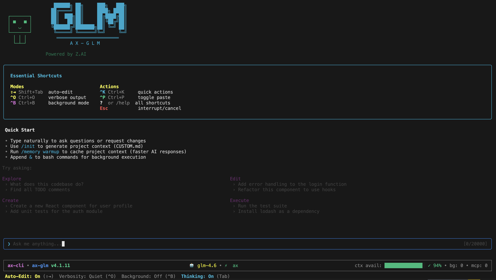
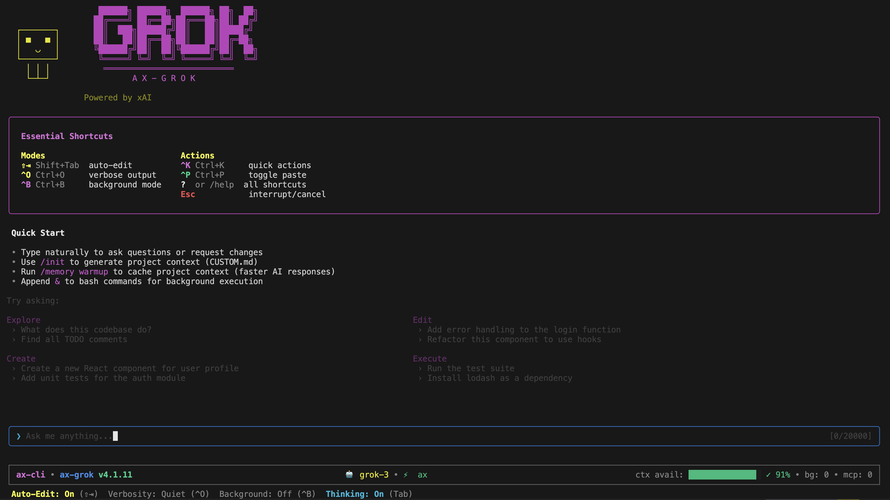

# AX CLI - Enterprise-Class Vibe Coding

[](https://npm-stat.com/charts.html?package=%40defai.digital%2Fax-cli)
[](#)
[](https://www.apple.com/macos)
[](https://www.microsoft.com/windows)
[](https://ubuntu.com)
[](https://nodejs.org/)
[](https://opensource.org/licenses/MIT)

## Table of Contents

- [Quick Start](#quick-start)
- [Why AX CLI?](#why-ax-cli)
- [Supported Models](#supported-models)
- [Installation](#installation)
- [Usage](#usage)
- [Configuration](#configuration)
- [MCP Integration](#mcp-integration)
- [VSCode Extension](#vscode-extension)
- [AutomatosX Integration](#automatosx-integration)
- [Project Memory](#project-memory)
- [Security](#security)
- [Architecture](#architecture)
- [Packages](#packages)
- [Changelog](#changelog)
- [Documentation](#documentation)
- [Enterprise](#enterprise)

---

<p align="center">
  
  
</p>

<p align="center">
  <strong>Enterprise-grade AI coding assistant optimized for GLM and Grok</strong>
</p>

## Quick Start

Get started in under a minute. Choose your AI provider and install the dedicated CLI:

<table>
<tr>
<td width="50%">

### GLM (Z.AI)

```bash
npm install -g @defai.digital/ax-glm
ax-glm setup
ax-glm
```

**Best for:** 200K context, thinking mode, Chinese language support

</td>
<td width="50%">

### Grok (xAI)

```bash
npm install -g @defai.digital/ax-grok
ax-grok setup
ax-grok
```

**Best for:** Live web search, vision, extended reasoning

</td>
</tr>
</table>

Run `/init` inside the CLI to initialize your project context.

> **Which CLI should I install?** Install `ax-glm` if you have a Z.AI API key, or `ax-grok` if you have an xAI API key. Both provide the same full-featured coding assistant, optimized for their respective providers.

---

## Why AX CLI?

| Feature | Description |
|---------|-------------|
| **Provider Optimized** | First-class support for GLM (Z.AI) and Grok (xAI) with provider-specific parameters |
| **17 Built-in Tools** | File editing, bash execution, search, todos, and more |
| **Agentic Behaviors** | ReAct reasoning loops, self-correction on failures, TypeScript verification |
| **AutomatosX Agents** | 20+ specialized AI agents for backend, frontend, security, DevOps, and more |
| **Autonomous Bug Fixing** | Scan and auto-fix timer leaks, resource issues, type errors with rollback safety |
| **Intelligent Refactoring** | Dead code removal, type safety fixes, complexity reduction with verification |
| **MCP Integration** | Model Context Protocol with 12+ production-ready templates |
| **Project Memory** | Intelligent context caching with 50% token savings |
| **Enterprise Security** | AES-256-GCM encryption, no telemetry, CVSS-rated protections |
| **65% Test Coverage** | 6,084+ tests with strict TypeScript |

---

### Provider highlights (GLM + Grok)
- **GLM (ax-glm)**: 200K context, **GLM 4.7** with enhanced reasoning and improved coding, thinking_mode support, strong Chinese language performance, vision via `glm-4.6v`, fast iterations via `glm-4-flash`.
- **Grok (ax-grok)**: Built-in web search, vision, reasoning_effort; **Grok 4.1 fast variants ship with 2M context, parallel server tools, x_search, and server-side code execution**. See `docs/grok-4.1-advanced-features.md` for details.
- Both CLIs share the same toolchain (file edits, MCP, bash) and project memory; pick the provider that matches your API key.
- Install both to run in parallel with isolated state (`.ax-glm`, `.ax-grok`) for side-by-side comparisons.

---

## Supported Models

### GLM (Z.AI)

| Model | Context | Features | Alias |
|-------|---------|----------|-------|
| `glm-4.7` | 200K | **Latest model**: Enhanced reasoning, improved coding, best overall performance | `glm-latest` |
| `glm-4.6` | 200K | **Thinking mode**: detailed thought processes and planning | `glm-thinking` |
| `glm-4.6v` | 128K | **Vision + Thinking**: latest vision model with native multimodal function calling | `glm-vision` |
| `glm-4-flash` | 128K | Fast, efficient for quick tasks | `glm-fast` |
| `cogview-4` | - | **Image generation**: text-to-image with variable resolutions | `glm-image` |

### Grok (xAI)

> **Grok 4.1 advanced**: ax-grok now enables Grok 4.1’s server-side agent tools (web_search, x_search, code_execution) with parallel function calling and 2M-context fast variants. See the full guide in `docs/grok-4.1-advanced-features.md`.

| Model | Context | Features | Alias |
|-------|---------|----------|-------|
| `grok-4.1` | 131K | Balanced default with built-in reasoning, vision, search | `grok-latest` |
| `grok-4.1-fast-reasoning` | 2M | Best for agentic/tool-heavy sessions with reasoning | `grok-fast` |
| `grok-4.1-fast-non-reasoning` | 2M | Fastest agentic runs without extended reasoning | `grok-fast-nr` |
| `grok-4-0709` | 131K | Original Grok 4 release (compatible) | `grok-4` |
| `grok-2-image-1212` | 32K | **Image generation**: text-to-image | `grok-image` |

> **Model Aliases**: Use convenient aliases like `ax-grok -m grok-latest` instead of full model names.

### Local/Offline Models (ax-cli)

For local inference via Ollama, LMStudio, or vLLM, use `ax-cli`:

```bash
npm install -g @defai.digital/ax-cli
ax-cli setup   # Select "Local/Offline"
```

**2025 Offline Coding LLM Rankings:**

| Tier | Model | Score | Best For |
|------|-------|-------|----------|
| **T1** | Qwen 3 (8B/14B/32B/72B) | 9.6/10 | **Best overall** - coding, refactor, debug leader. Best Claude Code alternative |
| **T2** | GLM-4.6 (9B/32B) | 9.4/10 | **Best for refactor + docs** - 9B rivals Qwen 14B, excellent long context reasoning |
| **T3** | DeepSeek-Coder V2 (7B/16B) | 9.3/10 | **Best speed/value** - 7B performs like 13B, great for edge devices |
| **T4** | Codestral / Mistral | 8.4/10 | **C/C++/Rust** - strong in systems languages, good supplement |
| **T5** | Llama 3.1 / CodeLlama | 8.1/10 | **Best fallback** - most compatible, works with all frameworks |

> **Recommendation**: Use **Qwen 3** as your primary model, **GLM-4.6** for large refactors and documentation, **DeepSeek** for fast iterations, and **Llama** as fallback.

---

## Installation

### Requirements

- Node.js 24.0.0+
- macOS 14+, Windows 11+, or Ubuntu 24.04+

### Install

```bash
# Choose your provider
npm install -g @defai.digital/ax-glm    # GLM (Z.AI)
npm install -g @defai.digital/ax-grok   # Grok (xAI)
```

### Setup

```bash
ax-glm setup   # or ax-grok setup
```

The setup wizard will guide you through:
1. Securely encrypting and storing your API key (using AES-256-GCM encryption).
2. Configuring your default AI model and other preferences.
3. Validating your configuration to ensure everything is set up correctly.

---

## Usage

### Interactive Mode

```bash
ax-glm              # Starts the interactive CLI session
ax-glm --continue   # Resume previous conversation
ax-glm -c           # Short form
```

### Headless Mode

```bash
ax-glm -p "analyze this codebase"
ax-glm -p "fix TypeScript errors" -d /path/to/project
```

### Agentic Behavior Flags

```bash
# Enable ReAct reasoning mode (Thought → Action → Observation cycles)
ax-glm --react

# Enable TypeScript verification after plan phases
ax-glm --verify

# Disable self-correction on failures
ax-glm --no-correction
```

By default, self-correction is ON (agent automatically retries on failures with reflection). ReAct and verification are OFF by default but can be enabled for more structured reasoning and quality checks.

### Essential Commands

| Command | Description |
|---------|-------------|
| `/init` | Initialize project context |
| `/help` | Show all commands |
| `/model` | Switch AI model |
| `/lang` | Change display language (11 languages) |
| `/doctor` | Run diagnostics |
| `/exit` | Exit CLI |

### Keyboard Shortcuts

| Shortcut | Action | Description |
|----------|--------|-------------|
| `Ctrl+O` | Toggle verbosity | Show or hide detailed logs and internal processes |
| `Ctrl+K` | Quick actions | Open the quick actions menu for common commands |
| `Ctrl+B` | Background mode | Run the current task in the background |
| `Shift+Tab` | Auto-edit | Trigger AI-powered code suggestions |
| `Esc` ×2 | Cancel | Clear current input or cancel ongoing operation |

---

## Configuration

### Config Files

| File | Purpose |
|------|---------|
| `~/.ax-glm/config.json` | User settings (encrypted API key) |
| `.ax-glm/settings.json` | Project overrides |
| `.ax-glm/CUSTOM.md` | Custom AI instructions |
| `ax.index.json` | Shared project index (at root, used by all CLIs) |

> Grok uses `~/.ax-grok/` and `.ax-grok/` directories. The `ax.index.json` is shared.

### Environment Variables

```bash
# For CI/CD
export ZAI_API_KEY=your_key    # GLM
export XAI_API_KEY=your_key    # Grok
```

---

## MCP Integration

Extend capabilities with [Model Context Protocol (MCP)](https://modelcontextprotocol.io) — an open standard for connecting AI assistants to external tools, APIs, and data sources:

```bash
ax-glm mcp add figma --template
ax-glm mcp add github --template
ax-glm mcp list
```

**Available Templates:** Figma, GitHub, Vercel, Puppeteer, Storybook, Sentry, Jira, Confluence, Slack, Google Drive, and more.

---

## VSCode Extension

```bash
code --install-extension defai-digital.ax-cli-vscode
```

- Sidebar chat panel
- Diff preview for file changes
- Context-aware commands
- Checkpoint & rewind system

---

## AutomatosX Integration

AX CLI integrates with [AutomatosX](https://github.com/defai-digital/automatosx) - a multi-agent AI system with autonomous bug fixing, intelligent refactoring, and 20+ specialized agents.

In interactive mode (`ax-glm` or `ax-grok`), just ask naturally:

```
> please scan and fix bugs in this codebase

> refactor the authentication module, focus on removing dead code

> use the security agent to audit the API endpoints

> review this PRD and work with the product agent to improve it

> ask the backend and frontend agents to implement user registration together
```

**What you get:**
- **Bug fixing**: Detects timer leaks, missing cleanup, resource issues - auto-fixes with rollback safety
- **Refactoring**: Removes dead code, fixes type safety, reduces complexity - verified by typecheck
- **20+ agents**: Backend, frontend, security, architecture, DevOps, data, and more

See [AutomatosX Guide](docs/AutomatosX-Integration.md) for agent list, advanced options, and configuration

---

## Project Memory

Reduce token costs and improve context recall with intelligent caching that stores and retrieves relevant project information, avoiding redundant processing.

```bash
ax-glm memory warmup    # Generate context cache
ax-glm memory status    # View token distribution
```

---

## Security

- **API Key Encryption:** AES-256-GCM with PBKDF2 (600K iterations)
- **No Telemetry:** Zero data collection
- **CVSS Protections:** Robust safeguards against common vulnerabilities like Command Injection (CVSS 9.8), Path Traversal (CVSS 8.6), and SSRF (CVSS 7.5).

---

## Architecture

AX CLI uses a modular architecture with provider-specific CLIs built on a shared core:

```
┌─────────────────────────────────────────────────────────────┐
│                      User Installs                          │
├─────────────────────────────┬───────────────────────────────┤
│      @defai.digital/ax-glm  │    @defai.digital/ax-grok     │
│         (ax-glm CLI)        │       (ax-grok CLI)           │
│                             │                               │
│  • GLM-4.6 thinking mode    │  • Grok 3 extended reasoning  │
│  • Z.AI API defaults        │  • xAI API defaults           │
│  • 200K context window      │  • Live web search            │
│  • ~/.ax-glm/ config        │  • ~/.ax-grok/ config         │
├─────────────────────────────┴───────────────────────────────┤
│                   @defai.digital/ax-core                    │
│                                                             │
│  Shared functionality: 17 tools, MCP client, memory,        │
│  checkpoints, React/Ink UI, file operations, git support    │
└─────────────────────────────────────────────────────────────┘
```

**Why separate CLIs?**
- **Isolated configuration:** Run `ax-glm` and `ax-grok` simultaneously without conflicts
- **Provider optimization:** Each CLI has tuned defaults for its AI provider
- **Cleaner setup:** `ax-glm setup` only asks for Z.AI config, `ax-grok setup` only asks for xAI config

---

## Packages

| Package | Install? | Description |
|---------|:--------:|-------------|
| [@defai.digital/ax-glm](https://www.npmjs.com/package/@defai.digital/ax-glm) | **Yes** | GLM-optimized CLI with web search, vision, image generation |
| [@defai.digital/ax-grok](https://www.npmjs.com/package/@defai.digital/ax-grok) | **Yes** | Grok-optimized CLI with web search, vision, extended thinking |
| [@defai.digital/ax-cli](https://www.npmjs.com/package/@defai.digital/ax-cli) | Optional | Local-first CLI for Ollama/LMStudio/vLLM + DeepSeek Cloud |
| [@defai.digital/ax-core](https://www.npmjs.com/package/@defai.digital/ax-core) | No | Shared core library (auto-installed as dependency) |
| [@defai.digital/ax-schemas](https://www.npmjs.com/package/@defai.digital/ax-schemas) | No | Shared Zod schemas (auto-installed as dependency) |

---

## Changelog

| Version | Highlights |
|---------|------------|
| **v5.1.4** | Fix: Added language change notice in setup wizard, clarify i18n scope |
| **v5.1.3** | Fix: Slash command execution (Tab completion bug), Language selection in setup wizard |
| **v5.1.2** | Fix: i18n locale files included in build, test fixes for glm-4.7 default |
| **v5.1.1** | Fix: `/lang` command now works in interactive mode |
| **v5.1.0** | i18n support (11 languages), `/lang` command, cleaner help & commands |
| **v5.0.1** | Documentation updates, GLM 4.7 model table |
| **v5.0.0** | GLM 4.7 support, Command Registry architecture, bug fixes |
| **v4.5.x** | Shift+Enter newlines, stability & performance improvements |
| **v4.4.x** | Agentic behaviors (ReAct, self-correction), 6,084+ tests |
| **v4.3.x** | Grok 4 support, MCP V2 client, deep project analysis |

[View full changelog on GitHub →](https://github.com/defai-digital/ax-cli/releases)

---

## Documentation

- [Features](docs/features.md)
- [Configuration](docs/configuration.md)
- [CLI Reference](docs/cli-reference.md)
- [MCP Integration](docs/mcp.md)
- [AutomatosX Guide](docs/AutomatosX-Integration.md)
- [VSCode Guide](docs/vscode-integration-guide.md)
- [Figma Integration](docs/figma-guide.md)
- [Troubleshooting](docs/troubleshooting.md)

---

## Enterprise

For teams requiring advanced capabilities:

- Compliance reports (SOC2, HIPAA)
- Advanced audit logging
- SSO/SAML integration
- Priority support (24-hour SLA)

Contact: **sales@defai.digital**

---

## License

MIT License - see [LICENSE](LICENSE)

---

<p align="center">
  Made with ❤️ by <a href="https://github.com/defai-digital">DEFAI Digital</a>
</p>
