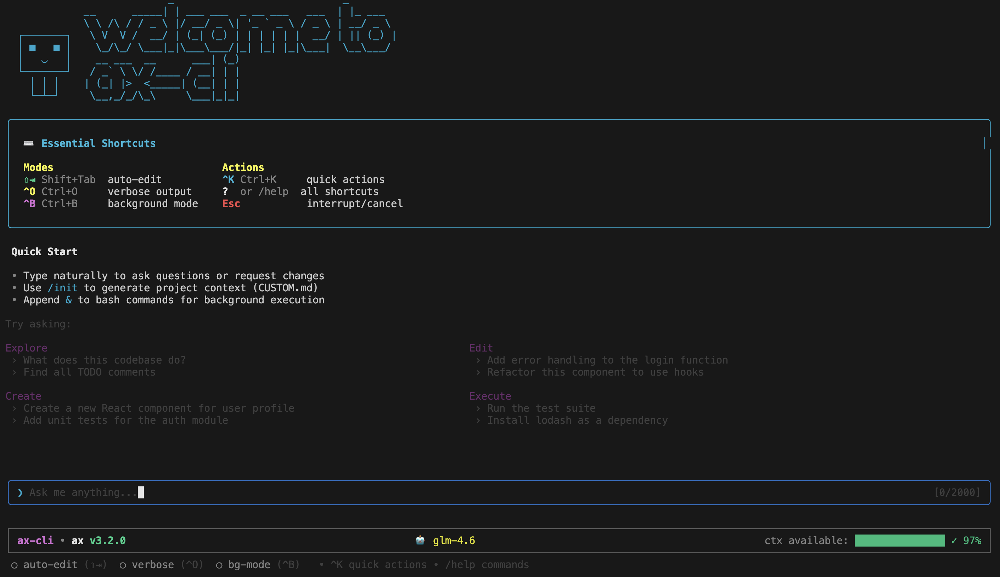

# AX CLI - Enterprise-Class CLI for Vibe Coding

[](https://npm-stat.com/charts.html?package=%40defai.digital%2Fax-cli)
[](https://github.com/defai-digital/ax-cli/actions/workflows/test.yml)
[](https://github.com/defai-digital/ax-cli)
[](https://nodejs.org/)
[](https://opensource.org/licenses/MIT)

<p align="center">
  
</p>

<p align="center">
  <strong>GLM-Optimized CLI • Enterprise Architecture • 98%+ Test Coverage • TypeScript & Zod</strong>
</p>

---

## Quick Start

```bash
# Install globally
npm install -g @defai.digital/ax-cli

# Configure (secure API key setup)
ax-cli setup

# Initialize your project
ax-cli init

# Start coding!
ax-cli
```

**That's it!** AX CLI is now ready to help you build, debug, and ship code faster.

---

## Table of Contents

- [Features](#features)
- [Installation](#installation)
- [Configuration](#configuration)
- [Usage](#usage)
- [MCP Integration](#mcp-integration)
- [Project Memory](#project-memory)
- [Multi-Phase Planner](#multi-phase-task-planner)
- [Security](#security)
- [Architecture](#architecture)
- [Changelog](#changelog)
- [Documentation](#documentation)

---

## Features

### Core Capabilities

| Feature | Description |
|---------|-------------|
| **GLM-Optimized** | Primary support for Z.AI's GLM-4.6 with 200K context window |
| **Multi-Phase Planner** | Intelligent task decomposition for complex requests |
| **Session Continuity** | Directory-specific conversation history with `--continue` |
| **MCP Integration** | Model Context Protocol with 12+ production-ready templates |
| **Project Memory** | Intelligent context caching with 50% token savings |
| **Smart Verbosity** | Three-level output control (Quiet → Concise → Verbose) |
| **Auto-Update** | Automatic update check on startup with user confirmation |

### AI Provider Support

- **Z.AI GLM-4.6** (default) - 32K max tokens, optimized for complex code generation
- **OpenAI** - GPT-4, GPT-3.5
- **Anthropic** - Claude models
- **Ollama** - Local models
- **Custom endpoints** - Any OpenAI-compatible API

> **Note**: For xAI Grok, use [grok-cli](https://github.com/superagent-ai/grok-cli). For Anthropic Claude, use [claude-code](https://claude.ai/code).

### Security (Enterprise-Grade, FREE)

| Protection | Severity | Description |
|------------|----------|-------------|
| API Key Encryption | - | AES-256-GCM encryption at rest |
| Command Injection | CVSS 9.8 | Safe command execution with whitelisting |
| Path Traversal | CVSS 8.6 | Prevent unauthorized file system access |
| SSRF Prevention | CVSS 7.5 | Validate MCP transport URLs |
| Input Sanitization | CVSS 7.0 | Comprehensive input validation |
| Rate Limiting | - | Token bucket algorithm (100 req/min) |

### Code Analysis Tools

- **Dependency Analyzer** - Circular dependencies, coupling metrics
- **Code Smell Detector** - 10+ anti-patterns detection
- **Hotspot Analyzer** - Git history-based complexity analysis
- **Security Scanner** - SQL injection, XSS, hardcoded secrets
- **Multi-Language Support** - TypeScript, JavaScript, Python, Rust, Go, C, C++, Swift, HTML, CSS

---

## Installation

### Supported Platforms

| Platform | Versions | Architecture |
|----------|----------|--------------|
| **macOS** | 26+ | x64, ARM64 (Apple Silicon) |
| **Windows** | 11+ | x64, ARM64 |
| **Ubuntu** | 24.04+ | x64, ARM64 |

### Prerequisites

- Node.js 24.0.0 or higher
- npm package manager

### Install

```bash
npm install -g @defai.digital/ax-cli
```

---

## Configuration

### Quick Setup (Recommended)

```bash
ax-cli setup
```

This interactive wizard will:
1. Guide you through provider selection
2. Securely encrypt and store your API key (AES-256-GCM)
3. Configure default model and settings
4. Validate your configuration

### Environment Variable Override

For CI/CD pipelines:

```bash
export YOUR_API_KEY=your_api_key_here
ax-cli
```

### Configuration Files

| File | Purpose |
|------|---------|
| `~/.ax-cli/config.json` | User settings (API keys encrypted) |
| `.ax-cli/settings.json` | Project-specific overrides |
| `.ax-cli/CUSTOM.md` | AI behavior customization |
| `.ax-cli/memory.json` | Auto-generated context cache |

### Auto-Update Settings

AX CLI automatically checks for updates on startup and prompts you to install. Configure in `~/.ax-cli/config.json`:

```json
{
  "autoUpdate": {
    "enabled": true,
    "checkIntervalHours": 24,
    "autoInstall": false
  }
}
```

| Setting | Default | Description |
|---------|---------|-------------|
| `enabled` | `true` | Enable/disable automatic update checks |
| `checkIntervalHours` | `24` | Hours between update checks (0 = always check) |
| `autoInstall` | `false` | Auto-install without prompting (not recommended) |

---

## Usage

### Interactive Mode

```bash
# Start interactive chat
ax-cli

# Continue previous conversation
ax-cli --continue
ax-cli -c
```

### Slash Commands

| Command | Description |
|---------|-------------|
| `/help` | Show help |
| `/continue` | Continue incomplete response |
| `/init` | Initialize project |
| `/clear` | Clear chat history |
| `/models` | Switch AI model |
| `/usage` | Show API usage statistics |
| `/doctor` | Run health check diagnostics |
| `/tasks` | List background tasks |
| `/exit` | Exit application |

### Keyboard Shortcuts

| Shortcut | Action |
|----------|--------|
| **Ctrl+O** | Cycle verbosity (Quiet → Concise → Verbose) |
| **Ctrl+B** | Move command to background |
| **Ctrl+K** | Quick actions menu |
| **Shift+Tab** | Toggle auto-edit mode |
| **Ctrl+C** | Clear input (press twice to exit) |
| **↑/↓** | Navigate command history |

### Headless Mode

```bash
# One-shot commands
ax-cli -p "analyze this codebase"
ax-cli -p "fix TypeScript errors" -d /path/to/project
ax-cli -p "write tests" --max-tool-rounds 50

# With specific model
ax-cli -p "refactor" --model glm-4.6
```

### Background Tasks

```bash
# Append '&' to run in background
> npm run dev &

# Or press Ctrl+B during execution

# Manage tasks
/tasks              # List all
/task bg_abc123     # View output
/kill bg_abc123     # Kill task
```

### Health Check

```bash
ax-cli doctor           # Run diagnostics
ax-cli doctor --verbose # Detailed output
ax-cli doctor --json    # JSON format
```

---

## MCP Integration

Extend AX CLI with Model Context Protocol servers:

```bash
# Add from template (one command!)
ax-cli mcp add figma --template

# Add custom server
ax-cli mcp add linear --transport sse --url https://mcp.linear.app/sse

# List servers
ax-cli mcp list

# Preview tools
ax-cli mcp tools <server>

# Browse templates
ax-cli mcp browse
```

### Available Templates

Figma, GitHub, Vercel, Puppeteer, Storybook, Sentry, and 6+ more.

### Per-Server Timeout

For long-running tools (e.g., AutomatosX):

```json
{
  "mcpServers": {
    "automatosx": {
      "transport": { "type": "stdio", "command": "ax", "args": ["mcp"] },
      "timeout": 2700000
    }
  }
}
```

---

## Project Memory

Intelligent context caching for reduced token costs:

```bash
# Initialize (scans codebase)
ax-cli memory warmup

# Output:
# ✓ Project memory generated (3,305 tokens)
# 📊 Token Distribution:
#    Structure:  1,252 tokens (38%)
#    README:     1,111 tokens (34%)
#    Config:       835 tokens (25%)
#    Patterns:      99 tokens (3%)
```

### Commands

| Command | Description |
|---------|-------------|
| `memory warmup` | Create project memory |
| `memory refresh` | Update after changes |
| `memory status` | Show status & token distribution |
| `memory clear` | Remove project memory |
| `memory cache-stats` | Show cache efficiency |

### Options

```bash
ax-cli memory warmup -d 5           # Custom scan depth (1-10)
ax-cli memory warmup -m 12000       # Custom max tokens
ax-cli memory warmup --dry-run      # Preview without saving
```

---

## Multi-Phase Task Planner

Automatic decomposition for complex requests:

```bash
> "Refactor auth, add tests, update docs"

📋 Plan Generated: 4 phases
├── Phase 1: Analysis (low risk)
├── Phase 2: Implementation (medium risk)
├── Phase 3: Testing (low risk)
└── Phase 4: Documentation (low risk)
```

### Plan Commands

| Command | Description |
|---------|-------------|
| `/plans` | List all execution plans |
| `/plan` | Show current plan details |
| `/phases` | Show phase progress |
| `/pause` | Pause current plan |
| `/resume` | Resume paused plan |
| `/skip` | Skip current phase |
| `/abandon` | Abandon current plan |

### Complexity Triggers

- Refactoring, migration, restructuring
- Multi-file changes
- Testing and documentation requests
- Multi-step instructions

---

## Security

### API Key Protection

- **AES-256-GCM** encryption at rest
- **PBKDF2** key derivation (600,000 iterations)
- **Secure permissions** (0600 owner-only)
- **Auto-migration** from plain-text

### Best Practices

1. **CI/CD**: Use environment variables
2. **Permissions**: Verify `ls -la ~/.ax-cli/config.json` shows `-rw-------`
3. **Git**: Add `.ax-cli/` to `.gitignore`
4. **Rotation**: Update regularly via `ax-cli setup`

### Privacy

- API keys: **Never logged**
- Telemetry: **None collected**
- Errors: Sanitized to remove sensitive data

### Report Issues

Email: **security@defai.digital** (private disclosure)

---

## Architecture

- **SSOT Type System** via `@ax-cli/schemas`
- **TypeScript strict mode** with Zod validation
- **98%+ test coverage** (2083 tests)
- **Modular design** with clean separation
- **Enterprise security** with AES-256-GCM encryption

---

## Changelog

### v3.11.4 (Latest)

- **Test Suite Fixes** - Fixed 12 failing tests in CI/CD pipeline for tool-grouper and change-summarizer modules
- **Tool Grouper Updates** - Updated tests to reflect single-item group unwrapping behavior (returns original entry instead of wrapping in ToolGroup)
- **Change Summarizer Updates** - Fixed line counting tests to match trimmed content behavior and 500+ line "large" file threshold

### v3.11.3

- **Bug Fixes: CLI Message Grouping** - Fixed parseInt NaN in diff-renderer, keyboard-hints fallback, semantic group duration color, reasoning-display marginBottom, diff-renderer gap separator
- **Bug Fixes: Paste Handling** - Fixed placeholder 1-based numbering, stale pastedBlocks closure, findBlockAtCursor guards, singular/plural line counts, negative ID guard, expandAllPlaceholders optimization
- **Bug Fixes: Display** - Fixed getFilePath for multi_edit, config file matching, renderFileContent empty content, MarkdownRenderer Promise handling, isCompatibleTransition fallback
- **Code Quality** - Removed console.error calls from paste error handling, added Shift+Enter detection normalization

### v3.10.1

- **Bug Fixes: Race Conditions** - Fixed double-resolution race conditions in VSCode IPC client, MCP singleton initialization, and tool approval timeout handling
- **Bug Fixes: Escape Sequence Handling** - Fixed broken escape sequence logic in input parsing (getStringState, hasCharOutsideStrings, isIncompleteInput)
- **Bug Fixes: Cache Invalidation** - Fixed tool version comparison to properly detect tool upgrades and invalidate stale cache
- **Code Quality** - Consistent flag-based escape tracking, improved error logging in debug mode

### v3.10.0

- **pnpm CI Migration** - Switched CI/CD from npm to pnpm for 2-3x faster installs (users still use `npm install`)
- **npm Compatibility Test** - Added dedicated CI job to verify npm users can still install and build
- **Workspace Protocol** - Updated workspace dependency to use `workspace:*` for proper pnpm support
- **CI Performance** - Follows pattern used by Vite, Vitest, Next.js for optimal CI speed

[View full changelog →](https://github.com/defai-digital/ax-cli/releases)

---

## Documentation

| Guide | Description |
|-------|-------------|
| [Features](docs/features.md) | Complete feature list |
| [Installation](docs/installation.md) | Detailed installation guide |
| [Configuration](docs/configuration.md) | Configuration options |
| [Usage](docs/usage.md) | Comprehensive usage guide |
| [CLI Reference](docs/cli-reference.md) | Command-line reference |
| [MCP Integration](docs/mcp.md) | Model Context Protocol guide |
| [Architecture](docs/architecture.md) | Technical architecture |
| [Troubleshooting](docs/troubleshooting.md) | Common issues |

---

## Enterprise Features

For teams requiring advanced capabilities:

- **Compliance Reports** - SOC2, HIPAA, PCI-DSS
- **Advanced Audit Logging** - Tamper-proof with 1+ year retention
- **Team Collaboration** - Shared history with full-text search
- **Policy Enforcement** - Approval workflows
- **SSO/SAML** - Enterprise identity provider support
- **Priority Support** - 24-hour SLA

Contact: **sales@defai.digital**

---

## Acknowledgments

This project was inspired by and partially based on [grok-cli](https://github.com/superagent-ai/grok-cli). Thanks to the original authors for their open-source contributions.

---

## License

MIT License - see [LICENSE](LICENSE) for details.

---

<p align="center">
  Made with ❤️ by <a href="https://github.com/defai-digital">DEFAI Digital</a>
</p>
